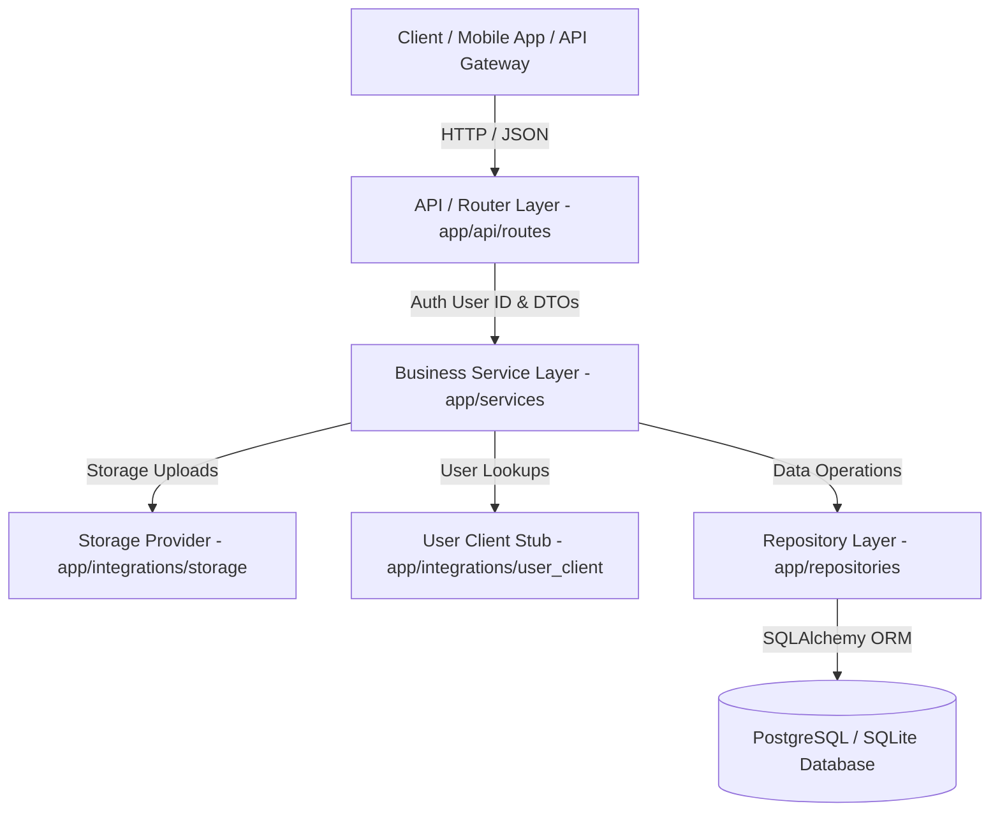

# Social Content & Post Microservice

Production-grade, highly scalable **Social Content & Post Microservice** built with Python 3.9+, FastAPI, SQLAlchemy 2.0, PostgreSQL/SQLite, Alembic migrations, Docker, and Pytest.

---

## 1. Service Purpose & Boundaries

### What This Service DOES Own:
- **Posts**: Creation, retrieval, updates, soft deletion, caption hashtag/mention parsing, status (`active`, `hidden`, `deleted`, `under_review`), and visibility (`public`, `followers`, `private`).
- **Comments & Replies**: Nested comment hierarchy using `parent_comment_id`.
- **Likes**: Atomic like tracking with database-enforced `UNIQUE(user_id, post_id)` constraints.
- **Saves / Bookmarks**: Atomic post saves with database-enforced `UNIQUE(user_id, post_id)` constraints and `/users/me/saved-posts`.
- **Media**: Upload & metadata tracking (images, videos, positions, width, height, duration) with local object storage & S3 readiness abstraction.
- **Feed**: Algorithmic & chronological feed building (`GET /api/v1/feed`) with cursor & offset pagination.
- **Denormalized Engagement**: Maintained O(1) counters (`like_count`, `comment_count`, `save_count`, `share_count`) on post entities.
- **Hashtags & Mentions**: Hashtag indexing (`#tag`) and mention tracking (`@user`).
- **Shares**: Share tracking (`POST /api/v1/posts/{post_id}/shares`).

### What This Service DOES NOT Own (Microservice Boundaries):
- **User Authentication / Profiles**: Auth & User databases belong to Auth/User Microservices. This service trusts verified JWT tokens and receives `user_id`.
- **Social Graph / Followers**: Follower relationships are owned by User/Social Graph Microservice. Post Service integrates via API boundaries without database cross-joins.
- **Direct Messaging & Notifications**: Owned by separate Messaging & Notification services.

---

## 2. Architecture



---

## 3. Tech Stack

- **Framework**: FastAPI (v0.128.8) + Uvicorn (v0.39.0)
- **Database & ORM**: PostgreSQL 15 / SQLite via SQLAlchemy 2.0 (v2.0.51)
- **Database Migrations**: Alembic (v1.16.5)
- **Validation**: Pydantic v2 (v2.13.4)
- **Configuration**: Pydantic Settings (v2.11.0)
- **Observability**: Correlation ID Middleware & Structured JSON Logger
- **Testing**: Pytest (v8.4.2) & HTTPX (v0.28.1)
- **Containerization & CI**: Multi-stage Dockerfile, Docker Compose, GitHub Actions CI

---

## 4. API Documentation

### Versioned Base URL: `/api/v1`

| Domain | Method | Endpoint | Purpose | Auth Required |
| :--- | :--- | :--- | :--- | :--- |
| **Health** | `GET` | `/api/v1/health/live` | Container liveness check | No |
| **Health** | `GET` | `/api/v1/health/ready` | Database readiness check | No |
| **Posts** | `POST` | `/api/v1/posts/` | Create post (derives `author_id`) | Yes |
| **Posts** | `GET` | `/api/v1/posts/{post_id}` | Get post details + engagement summary | Optional |
| **Posts** | `GET` | `/api/v1/posts/` | List posts (pagination, search, author) | No |
| **Posts** | `PUT` | `/api/v1/posts/{post_id}` | Update post (Author only) | Yes |
| **Posts** | `DELETE` | `/api/v1/posts/{post_id}` | Soft delete post (Author only) | Yes |
| **Comments** | `POST` | `/api/v1/posts/{post_id}/comments` | Add comment or nested reply | Yes |
| **Comments** | `GET` | `/api/v1/posts/{post_id}/comments` | List top-level comments & reply tree | No |
| **Comments** | `PUT` | `/api/v1/comments/{comment_id}` | Update comment (Author only) | Yes |
| **Comments** | `DELETE` | `/api/v1/comments/{comment_id}` | Delete comment (Author only) | Yes |
| **Likes** | `POST` | `/api/v1/posts/{post_id}/likes` | Like post (Atomic unique constraint) | Yes |
| **Likes** | `DELETE` | `/api/v1/posts/{post_id}/likes` | Unlike post | Yes |
| **Likes** | `GET` | `/api/v1/posts/{post_id}/likes/count` | Get total like count | No |
| **Saves** | `POST` | `/api/v1/posts/{post_id}/save` | Save/Bookmark post | Yes |
| **Saves** | `DELETE` | `/api/v1/posts/{post_id}/save` | Unsave post | Yes |
| **Saves** | `GET` | `/api/v1/users/me/saved-posts` | List user's saved posts | Yes |
| **Media** | `POST` | `/api/v1/posts/{post_id}/media` | Attach media item to post | Yes |
| **Media** | `DELETE` | `/api/v1/media/{media_id}` | Delete media item | Yes |
| **Feed** | `GET` | `/api/v1/feed/` | Fetch feed (cursor/offset pagination) | Optional |
| **Shares** | `POST` | `/api/v1/posts/{post_id}/shares` | Record post share & increment count | Yes |
| **Hashtags** | `GET` | `/api/v1/hashtags/{tag}/posts` | Get posts by hashtag | No |

---

## 5. Running & Deployment

### Portable Docker Compose Execution (Recommended)

This service is 100% portable and independent. Any developer can run it on their machine with zero local dependencies (no Python or local PostgreSQL required):

```bash
git clone <repository-url>
cd post-service
copy .env.example .env
docker compose up --build
```

- **Post Service**: `http://localhost:8000/api/v1`
- **Swagger Docs**: `http://localhost:8000/docs`
- **Inter-service Docker Network URL**: `http://post-service:8000`

### Local Execution (Development / Testing)
```bash
# 1. Activate virtual environment
source .venv/bin/activate  # or .\.venv\Scripts\Activate.ps1 on Windows

# 2. Run database migrations
alembic upgrade head

# 3. Start Uvicorn development server
uvicorn app.main:app --reload --port 8000

# 4. Run automated test suite
pytest -v
```

---

## 6. Microservice Boundary & Database Isolation

```sql
-- Post Table (No FK constraint to users table!)
CREATE TABLE posts (
    id SERIAL PRIMARY KEY,
    author_id INTEGER NOT NULL,  -- Standalone ID
    caption TEXT,
    visibility VARCHAR(20) NOT NULL DEFAULT 'public',
    status VARCHAR(20) NOT NULL DEFAULT 'active',
    like_count INTEGER NOT NULL DEFAULT 0,
    comment_count INTEGER NOT NULL DEFAULT 0,
    save_count INTEGER NOT NULL DEFAULT 0,
    share_count INTEGER NOT NULL DEFAULT 0,
    created_at TIMESTAMP WITH TIME ZONE DEFAULT NOW(),
    updated_at TIMESTAMP WITH TIME ZONE DEFAULT NOW()
);

-- Unique Constraints Enforced at Database Level
ALTER TABLE likes ADD CONSTRAINT uq_user_post_like UNIQUE (user_id, post_id);
ALTER TABLE saves ADD CONSTRAINT uq_user_post_save UNIQUE (user_id, post_id);
```